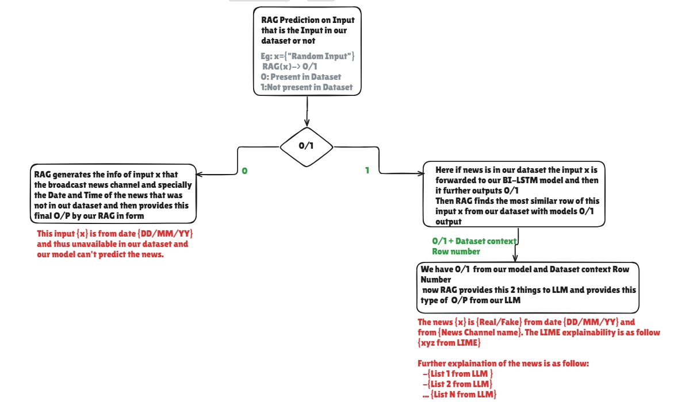

# 🚀 Fake News Detection API (BiLSTM + LIME)

Built **FastAPI backend**


First we should run this command for installing rag requirements

```
pip install -r requirements_rag.txt
```

## 📁 Project Structure

```
project/
│
├── app.py
├── model/
│   ├── bilstm_noisy_labels_model.h5
│   ├── tokenizer.pkl
│
├── requirements.txt
└── README.md
```

---

## ⚙️ Installation (Beginner Friendly)

### Step 1: Install Python

Use Python **3.10 or 3.11** (TensorFlow compatible)

---

### Step 2: Create virtual environment

```
python -m venv venv
venv\Scripts\activate
```

---

## ▶️ Test the API

```
uvicorn app:app --reload
```

Open in browser:

```
http://127.0.0.1:8000/docs
```

---

## 🧪 API Endpoints

### 1️⃣ FAST-API run Check

```
GET /
```

---

### 2️⃣ Predict (FAST)

```
POST /predict
```

Request:

```json
{
  "text": "Breaking news..."
}
```

Response:

```json
{
  "prediction": "real",
  "confidence": 0.92
}
```

---

### 3️⃣ Explain (SLOW - uses LIME)

```
POST /explain
```

Response:

```json
{
  "prediction": "fake",
  "confidence": 0.21,
  "explanation": [
    ["breaking", -0.4],
    ["official", 0.3]
  ]
}
```

## 👨‍💻 Author- Ahadthegreat

Built for learning and deployment of NLP models with explainability.
